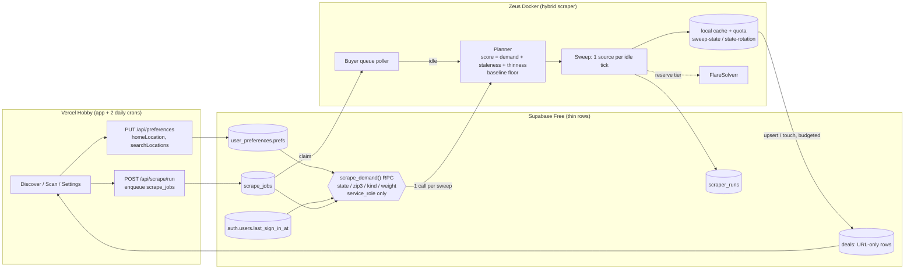

# User-driven scraping

Status: design + rollout plan, 2026-10-04. Owner: coverage track (track A).

MikeHunt scrapes where its signed-in users live and shop first, and still guarantees a baseline
sweep of every state. Heavy work runs in **Zeus Docker**. **Vercel Hobby** serves the app, runs two
daily crons, and writes demand signals as a side effect of normal requests. **Supabase Free**
(`qupzqpezslsbobhugswp`) stores thin, URL-only rows. No Fly. No photo bytes (`CACHE_PHOTOS_MAX=0`).
No invented prices. No LLM in the hot path.

## 1. Where we started (measured, read-only, 2026-10-04 11:20pm CT)

| Metric                                                                     | Value                                                                                 |
| -------------------------------------------------------------------------- | ------------------------------------------------------------------------------------- |
| Active deals                                                               | 2,609                                                                                 |
| Seen in the last 24h                                                       | **0** (last write 2026-10-02 11:53pm CT)                                              |
| Seen in the last 72h                                                       | 2,117                                                                                 |
| By source                                                                  | gov_auction 1,341 (50 states), copart 957 (48), independent_dealer 311 (**2 states**) |
| Retail rows (cars.com, AutoTrader, AutoTempest, Carvana, Craigslist, eBay) | **0**. None ran in 14 days of `scraper_runs`                                          |
| `sold_listings`                                                            | **0** (ebay_sold never ran)                                                           |
| Top / bottom states                                                        | FL 270, MO 265, TX 194 … WY 3, RI 2, SD 1, DC 0                                       |

Root causes, each fixed or in flight (see §9):

1. Zeus ran `SCRAPER_EXECUTION_MODE=queue`, which only serves buyer-clicked jobs. No broad sweep ever
   ran, and one `fetch failed` crashed the container into a restart loop. Fixed by #53.
2. Unchanged rows never bumped `deals.last_seen_at` on the local path, so live cars aged into the
   30-day deactivation. Fixed by #54.
3. A daily insert cap of 400 (pausing at 80%) allowed at most 320 new rows/day nationwide. Fixed by #62.
4. Each state had one seed ZIP, and each run searched one random state. Fixed by #63 (rotation + metro grid).
5. Craigslist sent `query=cars+trucks`, a full-text filter. In Dallas that matched 21 of 355 listings.
   Fixed by the Craigslist PR.

## 2. Architecture



- Vercel never scrapes and never schedules scrapes. It writes signals and reads results.
- Zeus pulls demand **once per sweep**: one RPC that returns at most a few hundred small rows.
- Buyer-clicked jobs always run first. A sweep runs one source per idle tick, so a buyer waits for at most
  one source.

## 3. Demand model: home vs search locations

Each user has two kinds of location. They stay separate in prefs, in the RPC, and in ranking.

|               | Home location                                                                                     | Search locations                                                                                                                         |
| ------------- | ------------------------------------------------------------------------------------------------- | ---------------------------------------------------------------------------------------------------------------------------------------- |
| Meaning       | Where the user lives                                                                              | Markets the user adds explicitly                                                                                                         |
| Source        | Signup / profile (legacy fallback `carsState`, then `buyerScope.state`)                           | Settings / Scan "add a market" (legacy fallback `carsStates[]`)                                                                          |
| Shape         | `prefs.homeLocation = { state, city?, zip?, radiusMi? }`                                          | `prefs.searchLocations = [{ id, state, city?, zip?, radiusMi?, label?, addedAt }]` (max 10)                                              |
| Scrape weight | 3 × recency                                                                                       | 2 × recency                                                                                                                              |
| Ranking       | Local radius from home ZIP (or state centroid) and same-state comps. No transport add-on in-state | That market's own comps (its state/metro). Ranking adds travel or shipping cost from home: `transportCostForMiles(miles(home, listing))` |

A recently searched state adds `1 × e^(−age_days/3)`. That means a `scrape_jobs.scope.state` from the
last 7 days. It captures intent without a new table.

PII: the RPC returns only `state`, `zip3`, `kind`, a weight, and a distinct-user count. No user ids,
no full ZIPs, no city. Prefs stay RLS-scoped to their owner.

## 4. Schema

### 4.1 Prefs (JSONB, no migration needed)

```ts
interface HomeLocation {
  state: string;
  city?: string;
  zip?: string;
  radiusMi?: number;
  updatedAt?: string;
}
interface SearchLocation {
  id: string;
  state: string;
  city?: string;
  zip?: string;
  radiusMi?: number;
  label?: string;
  addedAt: string;
}
interface Prefs {
  homeLocation?: HomeLocation;
  searchLocations?: SearchLocation[];
  carsState?: string;
  carsStates?: string[];
}
```

`PUT /api/preferences` sanitizes both keys:

- state must be one of the 50 states or DC
- ZIP must be 5 digits
- radius is clamped to 25–500 mi
- search locations are capped at 10 and deduped by state+zip
- city is trimmed to 60 chars

`effectiveHome(prefs)` and `effectiveSearchLocations(prefs)` read the new keys first, then the legacy ones.

### 4.2 `public.scrape_demand(p_active_days int default 30)`

The function is `SECURITY DEFINER` with `search_path = public`. `EXECUTE` is revoked from `anon` and
`authenticated` and granted to `service_role` only. It returns
`(state text, zip3 text, kind text, weight numeric, users int)`.

```
active user u : auth.users.last_sign_in_at >= now() - p_active_days
recency r(u)  : exp(-days_since_last_sign_in / 14)
home          : 3 · r(u) per user (homeLocation → carsState → buyerScope.state)
search        : 2 · r(u) per user per location (searchLocations → carsStates[])
recent        : 1 · exp(-age_days / 3) per scrape_jobs row in the last 7 days (scope.state / scope.states)
group by state, zip3, kind → sum(weight), count(distinct user)
```

If the function is missing (migration not applied yet), the scraper logs once and falls back to pure
rotation. Coverage never depends on demand being present.

## 5. Scheduler (Zeus, deterministic)

A work unit is **(source × state)**. Each sweep fixes its list of states once, then runs each source
over that list, one source per idle queue tick.

### 5.1 State score

For each state `s`:

- `D(s)` = summed demand weight
- `H(s)` = hours since the state was last swept
- `A(s)` = active listings (`count_by_state`)
- `T` = target revisit time, 24h

```
score(s) = 10 · ln(1 + D(s))           demand: home > search > recently searched
         +  2 · min(H(s) / T, 4)       staleness
         +  1 / (1 + A(s) / 100)       thin inventory
```

### 5.2 Slots per sweep (K = SWEEP_STATES_PER_RUN, default 10)

- **Baseline floor.** `F = max(3, ceil(0.4·K))` slots (4 of 10) always go to the least-recently-swept
  states, regardless of demand. Every one of the 51 is reached within `ceil(51/F)` = 13 sweeps, about
  2.5 days at a 4h cadence. Nothing starves.
- **Demand slots.** The remaining `K − F` slots go by `score(s)` among states with `D(s) > 0` that
  aren't already picked. Unused demand slots fall back to least-recently-swept.
- **Search centers.** Demand states get `SWEEP_ZIPS_PER_STATE + 1` metros. Metros whose ZIP prefix
  matches a demanded `zip3` go first, so a Springfield, MO user pulls the 658xx metro right away.
  Baseline states get `SWEEP_ZIPS_PER_STATE` (2), rotating across sweeps.

With one active MO home user, MO takes a demand slot almost every sweep (about 5–6 a day). The floor
still walks the other 50 states.

### 5.3 Source yield and health

The sweep state keeps a `zeroStreak` per source: the number of consecutive sweeps that returned 0 rows.
A failure counts as 0. A source with `zeroStreak = n ≥ 2` runs only on sweeps where
`sweepNumber mod 2^min(n−1, 3) = 0`, i.e. every 2nd, then 4th, then 8th sweep. One productive run
resets the streak. This handles anti-bot walls, dead sites, and empty gov feeds without spending idle
time other sources need. FlareSolverr stays the reserve tier inside `smartFetch`.

### 5.4 Ordering inside a sweep

Sources run in this order, and the daily insert budget is spent in the same order:

1. Retail sources with a VIN and a listing location: cars.com, AutoTrader, AutoTempest, Carvana,
   Craigslist, eBay Motors.
2. Curated dealers.
3. eBay sold.
4. Gov and salvage feeds.

## 6. Quotas and limits math

Measured: about 3 KB of JSON per `deals` row (100-row samples per source). Estimated: about 4 KB on disk
once indexes are included.

| Budget            | Setting                                                    | Effect                         |
| ----------------- | ---------------------------------------------------------- | ------------------------------ |
| New rows          | `MAX_DAILY_INSERTS=1250` (pauses at 80% = 1,000/day)       | ≤ 1,000 rows/day               |
| Changed rows      | `MAX_DAILY_UPDATES=2500` (2,000/day)                       | price and content changes      |
| Freshness touches | `MAX_DAILY_TOUCHES=20000`, at most once per row per 12h    | `last_seen_at` only, no egress |
| Retention         | nightly cron: inactive after 30d unseen, deleted after 60d | caps table size                |

**Supabase Free (500 MB DB, 5 GB egress/month)**

- **Rows.** ≤ 1,000/day × 60-day delete window ≈ **60k rows ≈ 240 MB** worst case. Today: 2,609 rows ≈ 10 MB.
- **Scraper egress.** Classify reads about 1 KB × ≤ 10k candidates/day, and upsert returns add about
  1 MB/day. Total **≈ 0.35 GB/month**. Touches and the demand and count RPCs are negligible.
- **App egress.** A Discover page reads about 50 rows × ~2 KB ≈ 100 KB. The remaining ~4.5 GB covers
  roughly 45k page views a month. Photos are URLs and never pass through Supabase.
- **MAU.** The 50k limit is not a concern.

**Vercel Hobby.** Crons are daily-only, and two are already in use (`profit-sniper`, `alerts/process`).
This design adds **no** crons. Demand writes ride on existing requests (prefs PUT, scan enqueue), and
Supabase Auth writes `last_sign_in_at` itself. Each demand write is one small upsert.

**Zeus.** The scraper container has 3 CPU / 4 GB. A 10-state sweep (estimate) covers:

- about 20 cars.com centers × 3 pages
- 10 AutoTrader centers × 3 pages
- about 60 AutoTempest calls
- about 30 Craigslist sites × 2 channels
- Carvana and the gov feeds

That is roughly 45–75 minutes of polite, delayed fetching, so about 5 sweeps a day at a 4h cadence.

**Per-state outlook (estimate, not measured).** At the 1,000/day insert cap, expect about 25–30k active
listings after 30 days, net of expiry. That is about 500 per baseline state and 2–4× that in states
with active home users. Re-measure with `count_by_state` 48h after the Zeus redeploy.

**Revised 2026-10-05 after the terms audit (§7).** The figures above assumed the retail sources would run.
With those sources restricted by default, the default sweep is the curated salvage/dealer network,
independent dealers, GovDeals and GSA. The last curated run produced 90 rows, and the gov feeds hold
about 1,341 active rows, some of them from PublicSurplus, which is now restricted. So expect the insert cap to be **far from binding**: roughly 1–3k active
listings, concentrated where the yards are (MO, IA, MN, NJ, PA, FL, TX). That is an estimate. The
row and egress ceilings above become very conservative upper bounds. More breadth needs licensed paths:
the eBay Browse API (key), the Copart members' CSV, or data feeds by permission (RebuildAutos/CDG).

## 7. Sources (terms and robots audit, 2026-10-05)

The rule: a source runs by default only if **robots.txt allows the paths AND the site's own terms don't
ban automated access**. On top of that, it needs no login, keeps at least 1.5 s between requests, stores
images as URLs only, and uses only real listed prices. Sites that serve a bot challenge get no stealth
or solver; they are skipped.

### 7.1 Default sweep (PR #85)

| Source                                                            | Why it's allowed                                                                                                                   |
| ----------------------------------------------------------------- | ---------------------------------------------------------------------------------------------------------------------------------- |
| `curated_dealers` (about 100 salvage, rebuilder and dealer sites) | Each site's robots.txt is checked per origin, homepage and inventory page, and the site-policy blocks below apply (#80)            |
| `independent_dealer`                                              | Dealer-owned sites, behind the same rules                                                                                          |
| `gsa_auctions`                                                    | US federal `ppms.gov` public API                                                                                                   |
| `govdeals`                                                        | No automated-access clause in its public auction terms. Its full User Agreement page wouldn't render, so it still **needs review** |

Already present and not duplicated: NHTSA vPIC VIN decode (single and batch) and recalls, in
`lib/vehicle/nhtsa.ts` and `/api/vin/[vin]`. Both are free and need no key.

### 7.2 Restricted: their terms ban automated access, so they're off by default (opt in via `SCRAPE_SOURCES`)

| Source             | Clause                                                                                                                                                                                                                                                                                                  |
| ------------------ | ------------------------------------------------------------------------------------------------------------------------------------------------------------------------------------------------------------------------------------------------------------------------------------------------------- |
| cars.com           | no robots, crawlers or spiders to access, query, collect or scrape                                                                                                                                                                                                                                      |
| Autotrader         | no automated means (robots, screen scrapers, spiders)                                                                                                                                                                                                                                                   |
| AutoTempest        | no bots, scrapers, crawlers or scripts without written authorization                                                                                                                                                                                                                                    |
| Carvana            | no bots, scripts, crawling, scraping or spidering                                                                                                                                                                                                                                                       |
| CarGurus           | no scraping or data mining                                                                                                                                                                                                                                                                              |
| Craigslist         | no collecting CL content via robots, spiders, scripts, scrapers or crawlers. **So the "salvage-title Craigslist searches" request was not built**: CL supports `auto_title_status=2/3` (St. Louis: 28 salvage + 58 rebuilt vs 362 total, checked 2026-10-05), but running it means breaking their terms |
| eBay Motors / sold | User Agreement bans robots without permission. The licensed path is the Browse API, which needs a key from Jonah                                                                                                                                                                                        |
| Copart             | Member Terms ban spidering, crawling and scraping. The Image & Data License says to use the members' CSV download                                                                                                                                                                                       |
| PublicSurplus      | no robot, spider or automatic device without written permission                                                                                                                                                                                                                                         |

### 7.3 Salvage aggregators and yards

| Site                                                                                                                | Status                     | Why                                                                                                                                                 |
| ------------------------------------------------------------------------------------------------------------------- | -------------------------- | --------------------------------------------------------------------------------------------------------------------------------------------------- |
| Damage.com (74 Auto, Sikeston MO)                                                                                   | **crawlable**              | No robots.txt (404, so allow-all). Terms cover deposits and sales only. About 220 priced cards on the homepage. Location fixed from FL to MO in #83 |
| D&G Auto (Poplar Bluff MO), St. James (MO), ReCar (Benton MO), Polecats, Glen's, Southside, Premier, Elite Sikeston | crawlable                  | robots allows, no ban found. The CDG card template already exists in `CDG_DEALERS`                                                                  |
| X2, Route 34, Sam's Riverside, Autoworld, AutoLS, Replica, Weller, Flora's, Chaya, SalvageZone, Prestige            | crawlable                  | robots allows, no ban found in the linked terms                                                                                                     |
| Midwest Repairables, Nordstrom's, TT Repairables and about 20 more                                                  | runtime-dependent          | 403 to a non-browser request from the box. The crawler's access-barrier logic skips them if Zeus gets the same answer                               |
| ProSalvage                                                                                                          | blocked                    | terms ban robots and spiders (Creative Design Group)                                                                                                |
| RebuildAutos, Rebuild1, RebuildTrucks                                                                               | blocked (needs permission) | Creative Design Group portals. CDG's terms ban automated access to "the Company's sites". RebuildAutos offers a data feed, so ask for it            |
| BidGoDrive                                                                                                          | blocked                    | terms ban copying, downloading or displaying materials                                                                                              |
| eRepairables                                                                                                        | blocked                    | terms ban copying content. Prices are behind a paywall and the site serves a bot challenge                                                          |
| RepairableVehicles.com                                                                                              | blocked                    | returns 403 for everything, including robots.txt                                                                                                    |
| AE of Miami, Global Auto Auctions, CAS Miami                                                                        | blocked                    | terms ban robots, spiders and scrapers                                                                                                              |
| Municibid                                                                                                           | blocked                    | terms ban reproducing or displaying, plus a bot challenge                                                                                           |
| AutoBidMaster, RideSafely, SalvageAutosAuction, SalvageReseller, Revroom                                            | blocked                    | Cloudflare challenge                                                                                                                                |
| JJ Kane                                                                                                             | not added                  | terms prohibit reproduction except under its copyright notice                                                                                       |
| HiBid, Purple Wave                                                                                                  | not added                  | terms not readable (client-rendered or not found)                                                                                                   |
| 25 Auto, Cameron, Riverbend and other yards with no verified URL                                                    | manual seed                | no domain was invented. Add them once a real URL is confirmed                                                                                       |

### 7.4 Skipped outright

| Source                                         | Why                                                                 |
| ---------------------------------------------- | ------------------------------------------------------------------- |
| KBB GraphQL intercept, BrightData, ScraperAPI  | ToS, stealth, cost                                                  |
| Facebook Marketplace, IAA, ACV, ADESA, Manheim | login or dealer-license walls                                       |
| KSL Classifieds                                | robots.txt `Disallow: /`                                            |
| Marketcheck, DataOne, MMR, CarQuery            | cost, or no free tier configured. CarQuery adds nothing beyond vPIC |

### 7.5 Valuation and title factors

MikeHunt already applies title factors **only to real comps**. In `lib/scoring/condition-value.ts`,
salvage is ×0.50 and rebuilt ×0.72 of the clean comp. Every factor is blended toward real salvage sold
medians when n ≥ 3, and the output is labelled with `basis` (comps / market / baseline), `titleMult` and
`soldAnchored`.

The suggested ×0.45 / ×0.70 were **not** applied. `sold_listings` has 0 rows, so there's no data to
calibrate them against. Changing them now would be a guess. Recalibrate once salvage sold pairs exist.

## 8. LLM: not needed

Planning, scoring, parsing, dedupe, and pricing are all deterministic. The hot path has no LLM and
none is planned. An optional local fallback (Ollama 3B on Zeus) could narrate a deal or attempt to
parse an unknown dealer page. It stays **off by default** and never produces or changes a price. Its
output is thrown away unless every field matches the page text. The invent consumer stays disabled.

## 9. Rollout (one concern per PR)

| PR  | Concern                                                                                                          |
| --- | ---------------------------------------------------------------------------------------------------------------- |
| #53 | Hybrid Docker mode, resilient queue claim (merged `dfd22cc`)                                                     |
| #54 | `last_seen_at` touch for unchanged rows (merged `7a3b27d`)                                                       |
| #62 | Free-tier write budget + slim classify reads (merged `30d5c53`)                                                  |
| #63 | State rotation + 50-state metro ZIP grid (merged `70e997b`)                                                      |
| #65 | This design doc (merged `f46d456`)                                                                               |
| #66 | Prefs: `homeLocation` / `searchLocations` split + sanitizer (merged `84b4a3c`)                                   |
| #67 | `scrape_demand()` RPC migration (merged `c024ba9`; **not yet applied on hosted**)                                |
| #68 | Craigslist: drop the full-text `cars trucks` filter (merged `567fc53`; CL is now restricted by default, see 7.2) |
| #70 | Demand-weighted planner + baseline floor + source backoff (merged `6d785ba`)                                     |
| #80 | robots.txt + site-policy gate for curated sites                                                                  |
| #83 | Damage.com location fixed (MO)                                                                                   |
| #85 | Default sweep skips terms-restricted sources                                                                     |
| —   | scrape-ci / scrape-worker default filtered through `TOS_RESTRICTED_SOURCES`; municibid + offerup restricted; health shows "Off for site terms"; `/api/discover` returns a `coverage` block |

### Zeus deploy (after merges)

The live scraper container is built from `C:\MikeHunt`, an old, dirty tree at `b1b28d4`. Build from the
clean `F:\MikeHunt\main` instead. Keep the same project name so the cache volume and state files carry
over.

```powershell
cd F:\MikeHunt\main
git fetch origin; git checkout master; git pull --ff-only
copy C:\MikeHunt\.env.local .env.local
copy C:\MikeHunt\.env.local.scraper .env.local.scraper
# edit .env.local.scraper: SCRAPER_EXECUTION_MODE=hybrid, MAX_DAILY_INSERTS=1250,
#   MAX_DAILY_UPDATES=2500, SWEEP_INTERVAL_HOURS=4, SWEEP_STATES_PER_RUN=10
robocopy C:\MikeHunt\cache .\cache /E
docker compose -p mikehunt -f docker-compose.local.yml -f F:\MikeHunt\docker\compose.cache-photos.yml up -d --build scraper
docker logs -f mikehunt-scraper-1   # expect "[sweep] states this sweep: ..."
```

After one sweep, check two things:

- `curl http://127.0.0.1:8787/status.json` shows a `sweep` block.
- `count_by_state` shows curated salvage/dealer sources appearing (retail sources are restricted by default; see 7.2).
- `[CuratedSites] skipping N by site policy` and any `robots.txt disallows` lines in the log.
